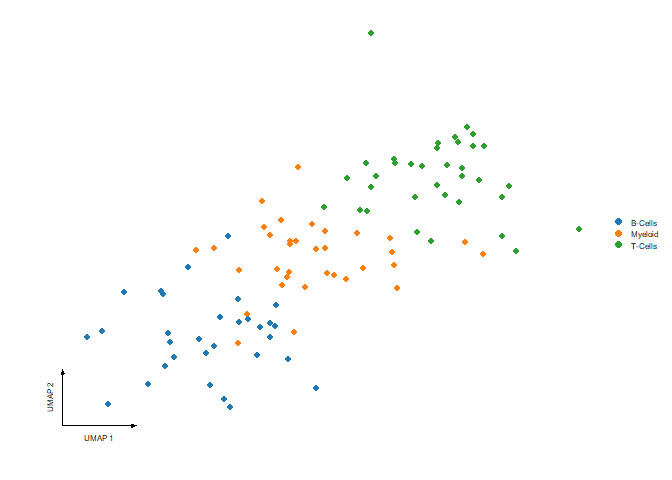

SeuratExtra
================

# SeuratExtra

The goal of SeuratExtra is to provide enhanced visualization tools for
single-cell RNA-seq data analysis.

## Installation

You can install the development version of SeuratExtra from
\[<https://github.com/zhangsyhub/SeuratExtra>\] with:

``` r
# install.packages("pak")
pak::pak("zhangsyhub/SeuratExtra")
```

or

``` r
# Install devtools if you haven't already
if (!require("devtools", quietly = TRUE))
    install.packages("devtools")

# Install SeuratExtra
devtools::install_github("zhangsyhub/SeuratExtra")
```

## Example

This is a basic example which shows you how to create a journal-quality
UMAP plot using DimPlot_ex::

``` r
library(SeuratExtra)
library(Seurat)
```

    ## Attaching SeuratObject

    ## Seurat v4 was just loaded with SeuratObject v5; disabling v5 assays and
    ## validation routines, and ensuring assays work in strict v3/v4
    ## compatibility mode

``` r
library(ggplot2)

# --- 1. Create a Synthetic Seurat Object ---
# Generate a random count matrix (Genes x Cells)
set.seed(42)
counts <- matrix(rpois(n = 10000, lambda = 3), nrow = 100, ncol = 100)
colnames(counts) <- paste0("Cell_", 1:100)
rownames(counts) <- paste0("Gene_", 1:100)

# Create the Seurat object
obj <- CreateSeuratObject(counts = counts)
```

    ## Warning: Feature names cannot have underscores ('_'), replacing with dashes
    ## ('-')
    ## Warning: Feature names cannot have underscores ('_'), replacing with dashes
    ## ('-')

``` r
# Assign random cell types
groups <- sample(c("T-Cells", "B-Cells", "Myeloid"), 100, replace = TRUE)
obj$celltype <- factor(groups)

# --- 2. Add Synthetic UMAP Coordinates ---
# Instead of running slow dimensional reduction, we generate mock coordinates
# ensuring the groups are visually distinct for demonstration.
umap_coords <- matrix(rnorm(200, sd = 2), ncol = 2)
colnames(umap_coords) <- c("UMAP_1", "UMAP_2")
rownames(umap_coords) <- colnames(obj)

# Shift points to create visual clusters
umap_coords[obj$celltype == "T-Cells", ] <- umap_coords[obj$celltype == "T-Cells", ] + 4
umap_coords[obj$celltype == "B-Cells", ] <- umap_coords[obj$celltype == "B-Cells", ] - 4

# Store embeddings in the object
obj[["umap"]] <- CreateDimReducObject(embeddings = umap_coords, key = "UMAP_", assay = "RNA")
# Load your Seurat object, ensuring it includes both cell type metadata and UMAP reductions.
# --- 3. Visualize with DimPlot_ex ---
# order = FALSE ensures random shuffling of points
p <- DimPlot_ex(
  object = obj,
  reduction = "umap",
  group.by = "celltype",
  axis_title = "UMAP",
  pt.size = 2,
  order = FALSE 
)

print(p)
```

<!-- --> \## Contributing Feel
free to submit issues or pull requests to improve the conversion logic!
